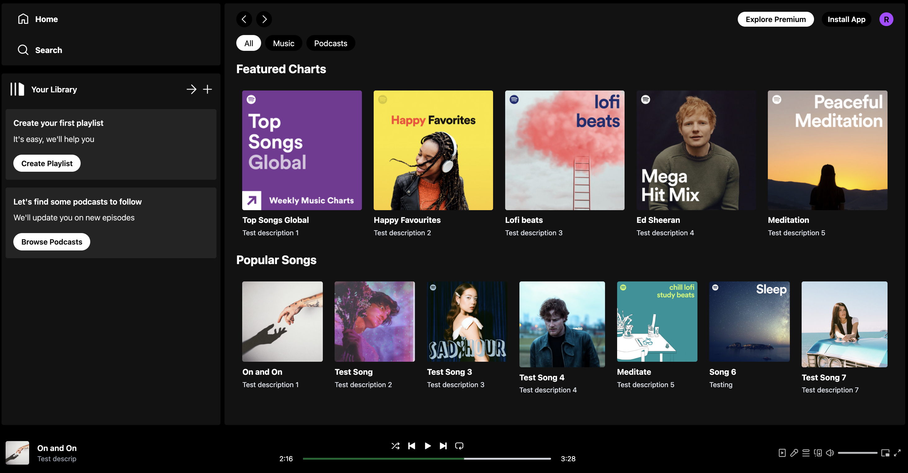
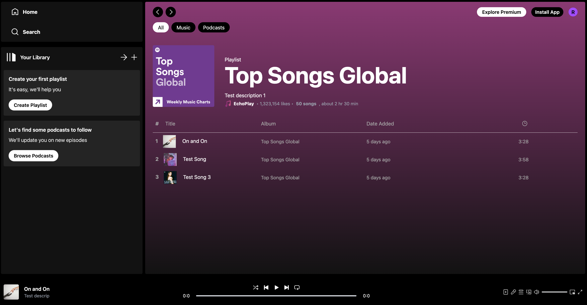
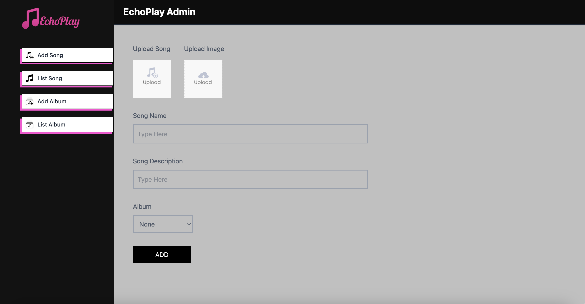
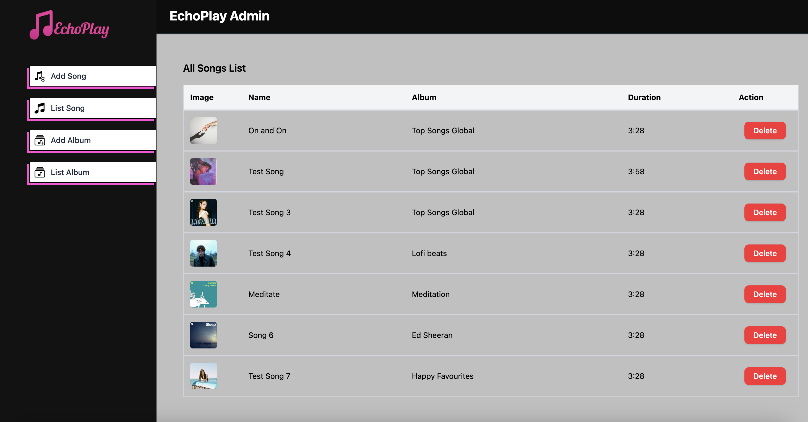

# EchoPlay

**EchoPlay** is a full-stack music streaming platform built with the MERN stack, inspired by Spotify. It offers audio playback, album management, cloud-hosted media, and a dedicated admin dashboard. Designed for seamless music discovery, EchoPlay features a responsive UI and robust backend services, delivering a modern, interactive listening experience.

--- 

## Deployment

The application is deployed and accessible online:

Frontend: [https://echoplay-frontend.onrender.com](https://echoplay-frontned.onrender.com/)

Admin Panel: [https://echoplay-admin.onrender.com](https://echoplay-admin.onrender.com/list-album)

Backend API: [https://echoplay-backend.onrender.com](https://echoplay-backend.onrender.com/)

---

## Screenshots

- **Home Page**

  

- **Album Page**

  

- **Admin Panel - Upload Page**

  

- **Admin Panel - Album List Page**

  

---

## Features

### Audio Playback

- **Audio Player with Seekbar** – Stream songs with play, pause, and seek functionality
- **Responsive Now Playing Section** – Displays current track details and playback controls
- **Auto Metadata Extraction** – Reads track metadata like its duration using `music-metadata`

### Album Management

- **Browse Albums** – View all available music albums with custom background colors
- **Individual Album Pages** – Explore track listings and stream directly from the album view
- **Dynamic Routing** – Seamless navigation between albums, player, and home without reloads

### Admin Panel

- **Secure Admin Dashboard** – Central hub to manage albums, uploads, and track listings
- **Add New Album** – Upload multiple audio tracks, select custom background colours, and set a cover image
- **Upload Songs to Specific Albums** – Upload individual songs and assign them to an existing album
- **List Songs** – View a list of all uploaded songs with their details
- **Cloudinary Integration** – Upload and host album images on a cloud CDN
- **Toast Notifications** – Instant feedback on actions like uploads and deletions

### Media Hosting & Management

- **Cloudinary for Image Hosting** – Efficient, scalable media storage and delivery
- **Multer for Audio Uploads** – Handle multi-track uploads per album
- **Automatic Metadata Parsing** – Auto-extracts track duration and details from audio files at upload time

### User Experience

- **Responsive UI** – Fully optimized for desktop and mobile screens
- **Spotify-Inspired Design** – Familiar and intuitive user interface for both listeners and admins
- **Fast Page Loads with Vite** – Lightning-quick development and production builds

---

## Tech Stack

### Frontend

- **React**
- **Vite**
- **TailwindCSS**
- **React Router DOM**
- **Axios**

### Admin Panel

- **React**
- **Vite**
- **TailwindCSS**
- **React Router DOM**
- **React Toastify**
- **Axios**

### Backend

- **Node.js**
- **Express.js**
- **MongoDB + Mongoose**
- **Cloudinary** 
- **Multer** 
- **music-metadata** 
- **CORS**
- **dotenv**
- **nodemon**

